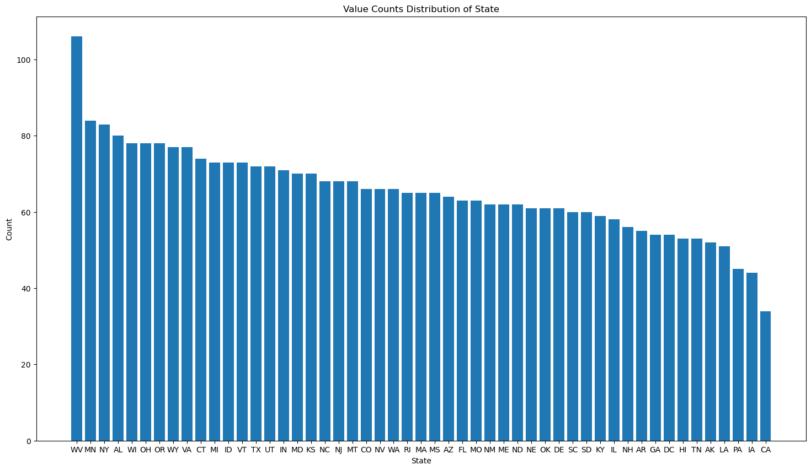

# CUSTOMER CHURN IN TELECOMUNICATION

**Author**  
Kennedy Owino

## Business Problem
---
Telecommunications companies face significant financial losses due to customer churn, wherein customers discontinue their services prematurely. Identifying and predicting customer churn is crucial for mitigating revenue loss, retaining valuable customers, and optimizing marketing strategies. However, without a comprehensive understanding of the underlying patterns and factors contributing to churn, businesses struggle to implement effective retention measures.
Therefore, the business problem of this revolves around the imperative need to identify and predict customer churn accurately.

## Business Understanding
---
In the competitive landscape of telecommunications, customer retention is paramount for sustained profitability and market growth. The ability to predict and prevent customer churn requires a deep understanding of customer behavior, preferences, and dissatisfaction triggers. By leveraging advanced data analytics and machine learning techniques, businesses can uncover actionable insights from vast amounts of customer data to identify at-risk customers and tailor retention strategies accordingly. 

### Key Objectives

$i.$ Develop a predictive model to identify customers at risk of churn based on historical data and relevant features. 
$ii.$ Identify significant factors influencing customer churn, including service usage patterns, demographics, contract terms, and customer interactions. 

$iii.$ Provide actionable insights to decision-makers for proactive churn management and resource allocation.

### Key Stakeholders
$1.$ **Telecom Executives:** Senior management and decision-makers responsible for devising strategic initiatives to improve customer retention and maximize revenue. 

$2.$ **Marketing and Sales Teams:** Teams responsible for implementing customer acquisition and retention campaigns, leveraging insights generated by the predictive model to tailor marketing strategies. 

$3.$ **Customer Service Representatives:** Frontline staff tasked with addressing customer concerns and enhancing customer satisfaction to reduce churn rates. 

$4.$ **Customers:** Ultimately, the end-users whose experiences and interactions drive churn behavior, and who stand to benefit from improved service offerings and personalized retention efforts.

## Data Understanding
---
The dataset utilized in this project is sourced from SyriaTel published on [Kaggle](https://www.kaggle.com/datasets/becksddf/churn-in-telecoms-dataset), encompassing comprehensive customer information. It includes data on customers' state of residence, telephone numbers, and account duration. Additionally, the dataset features columns specifying whether customers have an international plan and voicemail plan, along with details on the number of voicemails received. Furthermore, it encompasses data on the duration of calls, the frequency of calls made, and the corresponding charges incurred during the day, evening, and night periods.

## Exploratory Data Analysis

Based on the boxplots and histogram plots generated for the dataset above, it's observed that the majority of features exhibit approximately normal distributions with minimal presence of outliers. However, a notable exception is the `number of vmail messages` feature, which displays approximately negatively skewed distribution.

**Distribution of customers by state**

Plotting distribution of customers with internal plans and voice mail plans

Distibution of churn across customers

The dataset exhibits a significant class imbalance in the target variable, with approximately 85% of the records corresponding to customers who wouldn't churn (class 0). 
 Consequently, a simplistic model that consistently predicts non-churn (class 0) for all instances would achieve an accuracy of approximately 85%. The accuracy, while seemingly high, may be misleading due to the imbalanced nature of the dataset.

 ## Model Results
### Final Model Evaluation Metrics

- **Training Accuracy:** 0.983
- **Validation Accuracy:** 0.967

---------------------------------------------

- **Training Recall:** 0.974
- **Validation Recall:** 1.000

----------------------------------------------

- **Training Precision:** 0.992
- **Validation Precision:** 0.750

-----------------------------------------------

- **Training F1-score:** 0.983
- **Validation F1-score:** 0.857

-----------------------------------------------

- **Training AUC:** 0.980
- **Validation AUC:** 0.980

**Interpretation**

The model exhibits strong performance metrics across multiple evaluation criteria, indicating its effectiveness in predicting customer churn in the telecom industry.

$i.$ **Accuracy:** The high training and validation accuracy values (98.32% and 96.67% respectively) suggest that the model is adept at correctly classifying instances of both churners and non-churners.

$ii.$ **Recall:** The training recall of 97.38% indicates that the model can effectively identify the majority of actual churners in the training dataset. Additionally, achieving a validation recall of 100% implies that the model performs exceptionally well in identifying churners in unseen data.

$iii.$ **Precision:** The high precision values for both training (99.24%) and validation (75%) datasets signify that when the model predicts a customer as a churner, it is highly likely to be correct, particularly in the training set. However, there is a slight drop in precision for the validation set, indicating some false positives. This might be attributed to the class imbalance in validation set. However the model still perform exceptionally well.

$iv.$ **F1-score:** The F1-score, which balances precision and recall, is high for both training (98.30%) and validation (85.71%) datasets, suggesting a robust performance overall.

$v.$ **AUC (Area Under the ROC Curve):** The AUC values of 0.98 for both training and validation datasets indicate excellent discrimination ability of the model in distinguishing between churners and non-churners across different probability thresholds.

### Feature Importance
**Top 6 Important Features**

## Conclusions

$i.$ **High Performance:** The model exhibits excellent performance metrics, with high accuracy, recall, precision, F1-score, and AUC for both the training and validation datasets. This indicates that the model has successfully learned the patterns of customer churn and can effectively distinguish between churners and non-churners.

$ii.$ **Model Reliability:** The high recall value for both training and validation datasets indicates that the model can effectively identify the majority of actual churners. This is crucial for telecom companies as it ensures that the model can accurately detect customers who are at risk of churn, allowing for proactive intervention strategies.

$iii.$ **Influential Features:** Customer service calls, total day minutes, and day charges emerge as the most influential features, contributing significantly to the model's predictive power.

## Recommendations

Given the perfomance of the final model, the following recommendations are made;

$i.$ Given the importance of customer service calls in predicting churn, it's essential SyrialTel and Telecomunication companies should focus on improving the quality of customer service. This could involve reducing wait times, providing more personalized support, and addressing customer issues effectively to enhance overall satisfaction and reduce churn.

$ii.$ **Review International Plan Offerings:** Since customers with an international plan are more likely to churn, it may be beneficial for SyriaTel to review the current international plan offerings. This could involve optimizing plan features, pricing, and promotions to better meet the needs of international plan subscribers and improve retention.

$iii.$ **Enhance Voicemail Plan Adoption:** Customers without a voicemail plan are more likely to churn, suggesting that voicemail service may play a role in retaining customers. SyriaTel should encourage voicemail plan adoption through targeted marketing campaigns or incentives could help improve customer retention.

$iv.$ **Regular Model Monitoring and Updates:** Despite the high performance of the final model, it's crucial to regularly monitor its performance and update it as needed to maintain its effectiveness over time. This involves retraining the model with new data, reassessing feature importance, and making adjustments to model parameters or features as necessary.

$v.$ **Feedback loop:** Establish a feedback loop where the model's predictions are used to inform business decisions, and the outcomes of those decisions are fed back into the model to continuously improve its performance over time.

